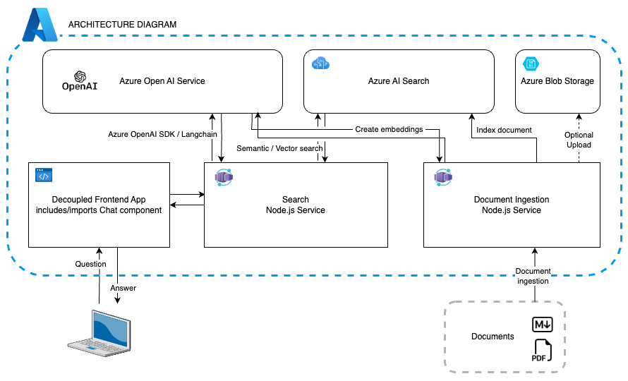
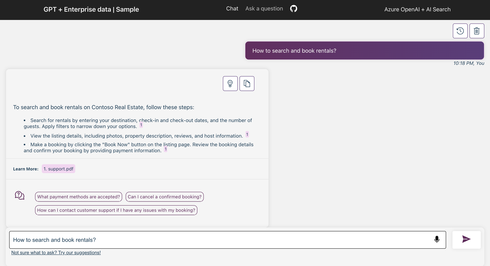

# ChatGPT + Enterprise data with Azure OpenAI and Azure AI Search

## Table of Contents

- [Features](#features)
- [Getting started](#getting-started)
- [Azure account requirements](#azure-account-prerequisites)
- [Azure deployment](#azure-deployment)
  - [Cost estimation](#cost-estimation)
  - [Project setup](#project-setup)
    - [GitHub Codespaces](#github-codespaces)
    - [VS Code Remote Containers](#vs-code-remote-containers)
    - [Local environment](#local-environment)
  - [Deploying from scratch](#deploying-from-scratch)
  - [Deploying with existing resources](#deploying-with-existing-resources)
  - [Deploying again](#deploying-again)
- [Sharing environments](#sharing-environments)
- [Clean up](#clean-up)
- [Enabling optional features](#enabling-optional-features)
  <!-- - [Enabling Application Insights](#enabling-application-insights) -->
  - [Enabling authentication](#enabling-authentication)
- [Using the app](#using-the-app)
- [Guidance](#guidance)
  - [Running locally](#running-locally)
  - [Using a different backend](#using-a-different-backend)
  - [Productionizing](#productionizing)
  - [Resources](#resources)
  - [FAQ](#faq)
  - [Troubleshooting](#troubleshooting)
  - [Reduce deployment costs](#reduce-deployment-costs)
- [Note](#note)

[](https://github.com/codespaces/new?hide_repo_select=true&ref=main&repo=684521881&machine=standardLinux32gb&devcontainer_path=.devcontainer%2Fdevcontainer.json&location=WestUs2)
[](https://vscode.dev/redirect?url=vscode://ms-vscode-remote.remote-containers/cloneInVolume?url=https://github.com/azure-samples/azure-search-openai-javascript)

This sample demonstrates a few approaches for creating ChatGPT-like experiences over your own data using the Retrieval Augmented Generation pattern. It uses Azure OpenAI Service to access the ChatGPT model (gpt-4o-mini), and Azure AI Search for data indexing and retrieval.


The repo includes sample data so it's ready to try end to end. In this sample application we use a fictitious company called Contoso Real Estate, and the experience allows its customers to ask support questions about the usage of its products. The sample data includes a set of documents that describe its terms of service, privacy policy and a support guide.

The application is made from multiple components, including:

- **Search service**: the backend service that provides the search and retrieval capabilities.
- **Indexer service**: the service that indexes the data and creates the search indexes.
- **Web app**: the frontend web application that provides the user interface and orchestrates the interaction between the user and the backend services.



## Features

- Chat and Q&A interfaces
- Explores various options to help users evaluate the trustworthiness of responses with citations, tracking of source content, etc.
- Shows possible approaches for data preparation, prompt construction, and orchestration of interaction between model (ChatGPT) and retriever (Azure AI Search)
- Settings directly in the UX to tweak the behavior and experiment with options
- Optional performance tracing and monitoring with Application Insights



[📺 Watch a video overview of the app](https://youtu.be/uckVTuS36H0)

## Getting started

## Azure account prerequisites

**IMPORTANT:** In order to deploy and run this sample, you'll need:

- **Azure account**. If you're new to Azure, [get an Azure account for free](https://azure.microsoft.com/free) to get free Azure credits to get started.
- **Azure subscription with access enabled for the Azure OpenAI service**. You can request access with [this form](https://aka.ms/oaiapply).
- **Azure account permissions**:
  - Your Azure account must have `Microsoft.Authorization/roleAssignments/write` permissions, such as [Role Based Access Control Administrator](https://learn.microsoft.com/azure/role-based-access-control/built-in-roles#role-based-access-control-administrator-preview), [User Access Administrator](https://learn.microsoft.com/azure/role-based-access-control/built-in-roles#user-access-administrator), or [Owner](https://learn.microsoft.com/azure/role-based-access-control/built-in-roles#owner). If you don't have subscription-level permissions, they must be granted to you with [RBAC](https://learn.microsoft.com/azure/role-based-access-control/built-in-roles#role-based-access-control-administrator-preview) for an existing resource group and [deploy to that existing group](#existing-resource-group).
  - Your Azure account also needs `Microsoft.Resources/deployments/write` permissions at a subscription level.

## Azure deployment

### Cost estimation

Pricing may vary per region and usage. Exact costs cannot be estimated.
You may try the [Azure pricing calculator](https://azure.com/e/8ffbe5b1919c4c72aed89b022294df76) for the resources below.

- Azure Container Apps: Pay-as-you-go tier. Costs based on vCPU and memory used. [Pricing](https://azure.microsoft.com/pricing/details/container-apps/)
- Azure Static Web Apps: Free Tier. [Pricing](https://azure.microsoft.com/pricing/details/app-service/static/)
- Azure OpenAI: Standard tier, ChatGPT and Ada models. Pricing per 1K tokens used, and at least 1K tokens are used per question. [Pricing](https://azure.microsoft.com/pricing/details/search/)
- Azure AI Search: Standard tier, 1 replica, free level of semantic search\*. Pricing per hour.[Pricing](https://azure.microsoft.com/pricing/details/search/) (_The pricing may vary or reflect an outdated tier model. Please visit the linked page for more accurate information_)
- Azure Blob Storage: Standard tier with ZRS (Zone-redundant storage). Pricing per storage and read operations. [Pricing](https://azure.microsoft.com/pricing/details/storage/blobs/)
- Azure Monitor: Pay-as-you-go tier. Costs based on data ingested. [Pricing](https://azure.microsoft.com/pricing/details/monitor/)

⚠️ To avoid unnecessary costs, remember to take down your app if it's no longer in use,
either by deleting the resource group in the Portal or running `azd down --purge`.

### Project setup

There are multiple ways to successfully setup this project.

The easiest way to get started is with GitHub Codespaces that provides preconfigurations to setup all the tools for you. [Read more below](#github-codespaces).
Alternatively you can [set up your local environment](#local-environment) follwing the instructions below.

#### GitHub Codespaces

You can run this repo virtually by using GitHub Codespaces, which will open a web-based VS Code in your browser:

[](https://github.com/codespaces/new?hide_repo_select=true&ref=main&repo=684521881&machine=standardLinux32gb&devcontainer_path=.devcontainer%2Fdevcontainer.json&location=WestUs2)

#### VS Code Remote Containers

A similar option to Codespaces is VS Code Remote Containers, that will open the project in your local VS Code instance using the [Dev Containers extension](https://marketplace.visualstudio.com/items?itemName=ms-vscode-remote.remote-containers):

[](https://vscode.dev/redirect?url=vscode://ms-vscode-remote.remote-containers/cloneInVolume?url=https://github.com/azure-samples/azure-search-openai-javascript)

#### Local environment

- [Azure Developer CLI](https://aka.ms/azure-dev/install)
- [Node.js LTS](https://nodejs.org/en/download/)
- [Docker for Desktop](https://www.docker.com/products/docker-desktop/)
- [Git](https://git-scm.com/downloads)
- [Powershell 7+ (pwsh)](https://github.com/powershell/powershell) - For Windows users only.
  - **Important**: Ensure you can run `pwsh.exe` from a PowerShell command. If this fails, you likely need to upgrade PowerShell.

Then get the project code:

1. Create a new folder and switch to it in the terminal
1. Run `azd auth login`
1. Run `azd init -t azure-search-openai-javascript`
   - note that this command will initialize a git repository and you do not need to clone this repository

### Deploying from scratch

Execute the following command, if you don't have any pre-existing Azure services and want to start from a fresh deployment.

1. Run `azd up` - This will provision Azure resources and deploy this sample to those resources, including building the search index based on the files found in the `./data` folder.
   - You will be prompted to select a location for the majority of resources, except for the OpenAI and Static Web App resources.
   - By default, the OpenAI resource will be deployed to `eastus2`. You can set a different location with `azd env set AZURE_OPENAI_RESOURCE_GROUP_LOCATION {location}`. Currently only a short list of locations is accepted. That location list is based on the [OpenAI model availability table](https://azure.microsoft.com/explore/global-infrastructure/products-by-region/?products=search) and may become outdated as availability changes.
   - By default, the Staic Web App resource will be deployed to `eastus2`. You can set a different location with `azd env set AZURE_WEBAPP_LOCATION {location}`. Currently only a short list of locations is accepted. Note that Static Web App is a global service, and the location you choose will only affect the managed Functions App which is not used in this sample.
1. After the application has been successfully deployed you will see a URL printed to the console. Click that URL to interact with the application in your browser.

It will look like the following:


> NOTE: It can take 15+ minutes for the application to be fully deployed.

### Deploying with existing resources

If you already have existing Azure resources, you can re-use those by setting `azd` environment values.

#### Existing resource group

1. Run `azd env set AZURE_RESOURCE_GROUP {Name of existing resource group}`
1. Run `azd env set AZURE_LOCATION {Location of existing resource group}`

#### Existing OpenAI resource

1. Run `azd env set AZURE_OPENAI_SERVICE {Name of existing OpenAI service}`
1. Run `azd env set AZURE_OPENAI_RESOURCE_GROUP {Name of existing resource group that OpenAI service is provisioned to}`
1. Run `azd env set AZURE_OPENAI_CHATGPT_DEPLOYMENT {Name of existing ChatGPT deployment}`. Only needed if your ChatGPT deployment is not the default 'chat'.
1. Run `azd env set AZURE_OPENAI_EMBEDDING_DEPLOYMENT {Name of existing GPT embedding deployment}`. Only needed if your embeddings deployment is not the default 'embedding'.

#### Existing Azure AI Search resource

1. Run `azd env set AZURE_SEARCH_SERVICE {Name of existing Azure AI Search service}`
1. Run `azd env set AZURE_SEARCH_SERVICE_RESOURCE_GROUP {Name of existing resource group with ACS service}`
1. If that resource group is in a different location than the one you'll pick for the `azd up` step,
   then run `azd env set AZURE_SEARCH_SERVICE_LOCATION {Location of existing service}`
1. If the search service's SKU is not standard, then run `azd env set AZURE_SEARCH_SERVICE_SKU {Name of SKU}`. The free tier won't work as it doesn't support managed identity. ([See other possible values](https://learn.microsoft.com/azure/templates/microsoft.search/searchservices?pivots=deployment-language-bicep#sku))

#### Other existing Azure resources

You can also use an existing Storage Account. See `./infra/main.parameters.json` for list of environment variables to pass to `azd env set` to configure those existing resources.

#### Provision remaining resources

Now you can run `azd up`, following the steps in [Deploying from scratch](#deploying-from-scratch) above.
That will both provision resources and deploy the code.

### Deploying again

If you've only changed the backend/frontend code in the `app` folder, then you don't need to re-provision the Azure resources. You can just run:

`azd deploy`

If you've changed the infrastructure files (`infra` folder or `azure.yaml`), then you'll need to re-provision the Azure resources. You can do that by running:

`azd up`

## Sharing environments

To give someone else access to a completely deployed and existing environment,
either you or they can follow these steps:

1. Install the [Azure Developer CLI](https://aka.ms/azure-dev/install)
1. Run `azd init -t azure-search-openai-javascript` or clone this repository.
1. Run `azd env refresh -e {environment name}`
   They will need the azd environment name, subscription ID, and location to run this command. You can find those values in your `.azure/{env name}/.env` file. This will populate their azd environment's `.env` file with all the settings needed to run the app locally.
1. Set the environment variable `AZURE_PRINCIPAL_ID` either in that `.env` file or in the active shell to their Azure ID, which they can get with `az ad signed-in-user show`.
1. Run `./scripts/roles.ps1` or `./scripts/roles.sh` to assign all of the necessary roles to the user. If they do not have the necessary permission to create roles in the subscription, then you may need to run this script for them. Once the script runs, they should be able to run the app locally.

## Clean up

To clean up all the resources created by this sample:

1. Run `azd down --purge`
2. When asked if you are sure you want to continue, enter `y`
3. When asked if you want to permanently delete the resources, enter `y`

The resource group and all the resources will be deleted.

## Enabling optional features

<!-- ### Enabling Application Insights

To enable Application Insights and the tracing of each request, along with the logging of errors, set the `AZURE_USE_APPLICATION_INSIGHTS` variable to true before running `azd up`

1. Run `azd env set AZURE_USE_APPLICATION_INSIGHTS true`
1. Run `azd up`

To see the performance data, go to the Application Insights resource in your resource group, click on the "Investigate -> Performance" blade and navigate to any HTTP request to see the timing data.
To inspect the performance of chat requests, use the "Drill into Samples" button to see end-to-end traces of all the API calls made for any chat request:


To see any exceptions and server errors, navigate to the "Investigate -> Failures" blade and use the filtering tools to locate a specific exception. You can see Python stack traces on the right-hand side. -->

### Enabling authentication

By default, the deployed Azure web app will have no authentication or access restrictions enabled, meaning anyone with routable network access to the web app can chat with your indexed data. You can require authentication to your Azure Entra ID by following the [Add app authentication](https://learn.microsoft.com/training/modules/publish-static-web-app-authentication/) tutorial and set it up against the deployed web app.

To then limit access to a specific set of users or groups, you can follow the steps from [Restrict your Azure Entra app to a set of users](https://learn.microsoft.com/entra/identity-platform/howto-restrict-your-app-to-a-set-of-users) by changing "Assignment Required?" option under the Enterprise Application, and then assigning users/groups access. Users not granted explicit access will receive the error message -AADSTS50105: Your administrator has configured the application <app_name> to block users unless they are specifically granted ('assigned') access to the application.-

### Additional security considerations

We recommend deploying additional security mechanisms. When applicable, consider setting up a [VNet](https://learn.microsoft.com/azure/virtual-network/virtual-networks-overview) or setting up a [Proxy Policy](https://learn.microsoft.com/azure/api-management/proxy-policy).

### Enabling CORS for an alternate frontend

By default, the deployed search API will only allow requests from the same origin as the deployed web app origin. To enable [CORS](https://developer.mozilla.org/docs/Web/HTTP/CORS) for a frontend hosted on a different origin, run:

1. Run `azd env set ALLOWED_ORIGIN https://<your-domain.com>`
2. Run `azd up`

## Running locally

You can only run locally **after** having successfully run the `azd up` command.

1. Run `azd auth login`
2. Run `azd env get-values > .env` to get the environment variables for the app.
3. Run `./scripts/index-data.sh` or `./scripts/index-data.ps1` to index the data.
4. Run `az login` to log in to your Azure account (needed for managed identity)
5. Run `npm start` or run the "VS Code Task: Start App" to start the project locally.

## Using the app

- In Azure: navigate to the Azure Static Web App deployed by azd. The URL is printed out when azd completes (as "Endpoint"), or you can find it in the Azure portal.
- Running locally: navigate to http://127.0.0.1:5173

Once in the web app:

- Try different topics in chat or Q&A context. For chat, try follow up questions, clarifications, ask to simplify or elaborate on answer, etc.
- Explore citations and sources
- Click on "settings" to try different options, tweak prompts, etc.

## Guidance

### Using a different backend

The Search API service implements the [HTTP protocol for AI chat apps](https://aka.ms/chatprotocol). It can be swapped with any service that implements the same protocol, like the [Python backend client in this repository](https://github.com/Azure-Samples/azure-search-openai-demo) instead of the Node.js implementation featured in this repo.

To do so, follow these steps:

1. Deploy this repository, following the steps above.
2. Get the frontend URL:

- If you want to use the deployed web app, run `azd env get-values | grep WEBAPP_URI` to get the URL.
- If you want to use the local web app, use `http://localhost:5173`.
- If you want to use the Codespaces local web app, use `https://<your_codespace_base_url>-5173.app.github.dev`.

3. Open the alternative backend repository your want to use, for example: https://github.com/Azure-Samples/azure-search-openai-demo
4. Set the frontend URL as an allowed origin with `azd env set ALLOWED_ORIGIN <your_frontend_url>`.
5. Follow the [steps to deploy the Python backend](https://github.com/Azure-Samples/azure-search-openai-demo#deploying-from-scratch).
6. Once the Python backend is fully deployed, get the backend URL with `azd env get-values | grep BACKEND_URI`.
7. Set the backend URL in this repo, running `azd env set BACKEND_URI <your_backend_url>`.
8. Depending on whether you want to use the deployed web app or the local web app:

- If you want to use the deployed web app, run `azd up` to redeploy.
- If you want to use the local web app on your machine or in Codespaces, run:

  ```sh
  # Export the environment variable.
  # The syntax may be different depending on your shell or if you're using Windows.
  export BACKEND_URI=<your_backend_url>

  # Start the app
  npm start --workspace=webapp
  ```

### Enabling Authentication

This sample is composed by two applications: a backend service and API, deployed to [Azure Container Apps](https://learn.microsoft.com/azure/container-apps/overview), and a frontend application, deployed to [Azure Static Web Apps](https://azure.microsoft.com/products/app-service/static/). By default, the deployed Azure Container App will have no authentication or access restrictions enabled, meaning anyone with routable network access to the container app can chat with your indexed data. You can require authentication to your Azure Entra ID by following the [Add container app authentication](https://learn.microsoft.com/azure/container-apps/authentication-azure-active-directory) tutorial and set it up against the deployed Azure Container App.

To limit access to a specific set of users or groups, you can follow the steps from [Restrict your Azure Entra app to a set of users](https://learn.microsoft.com/entra/identity-platform/howto-restrict-your-app-to-a-set-of-users) by changing "Assignment Required?" option under the Enterprise Application, and then assigning users/groups access. Users not granted explicit access will receive the error message -AADSTS50105: Your administrator has configured the application <app_name> to block users unless they are specifically granted ('assigned') access to the application.-

### Productionizing

This sample is designed to be a starting point for your own production application, but you should do a thorough review of the security and performance before deploying to production. Here are some things to consider:

- **OpenAI Capacity**: The default TPM (tokens per minute) is set to 30K. That is equivalent to approximately 30 conversations per minute (assuming 1K per user message/response). You can increase the capacity by changing the `chatGptDeploymentCapacity` and `embeddingDeploymentCapacity` parameters in `infra/main.bicep` to your account's maximum capacity.
  You can also view the Quotas tab in [Azure OpenAI studio](https://oai.azure.com/) to understand how much capacity you have.
- **Azure Storage**: The default storage account uses the `Standard_LRS` SKU.
  To improve your resiliency, we recommend using `Standard_ZRS` for production deployments, which you can specify using the `sku` property under the `storage` module in `infra/main.bicep`.
- **Azure AI Search**: The default search service uses the `Standard` SKU with the free semantic search option, which gives you 1000 free queries a month. Assuming your app will experience more than 1000 questions, you should either change `semanticSearch` to "standard" or disable semantic search entirely in the request options. If you see errors about search service capacity being exceeded, you may find it helpful to increase the number of replicas by changing `replicaCount` in `infra/core/search/search-services.bicep` or manually scaling it from the Azure Portal.
- **Azure Container Apps**: The default container app setup uses 1 vCPU core and 2 GB RAM per container, with autoscaling enabled. The minimum number of replicas is set to 1, and the maximum to 10.
  You can change vCPU and RAM capacity [in the template](https://github.com/Azure-Samples/azure-search-openai-javascript/blob/main/infra/main.bicep#L144-L145), and define your own auto-scaling rules based on load.
  For more details, read [Set scaling rules in Azure Container Apps](https://learn.microsoft.com/azure/container-apps/scale-app?pivots=azure-resource-manager).
- **Authentication**: By default, the deployed app is publicly accessible.
  We recommend restricting access to authenticated users.
  See [Enabling authentication](#enabling-authentication) above for how to enable authentication.
- **Networking**: We recommend deploying inside a Virtual Network. If the app is only for internal enterprise use, use a private DNS zone. Also consider using Azure API Management (APIM) for firewalls and other forms of protection.
For more details, read [Azure OpenAI Landing Zone reference architecture](https://techcommunity.microsoft.com/t5/azure-architecture-blog/azure-openai-landing-zone-reference-architecture/ba-p/3882102).
<!-- * **Loadtesting**: We recommend running a loadtest for your expected number of users.
  You can use the [locust tool](https://docs.locust.io/) with the `locustfile.py` in this sample
  or set up a loadtest with Azure Load Testing. -->

## Resources

- [Generative AI For Beginners](https://github.com/microsoft/generative-ai-for-beginners)
- [Revolutionize your Enterprise Data with ChatGPT: Next-gen Apps w/ Azure OpenAI and AI Search](https://aka.ms/entgptsearchblog)
- [Azure AI Search](https://learn.microsoft.com/azure/search/search-what-is-azure-search)
- [Azure OpenAI Service](https://learn.microsoft.com/azure/ai-services/openai/overview)
- [Building ChatGPT-Like Experiences with Azure: A Guide to Retrieval Augmented Generation for JavaScript applications](https://devblogs.microsoft.com/azure-sdk/building-chatgpt-like-experiences-with-azure-a-guide-to-retrieval-augmented-generation-for-javascript-applications/)

### FAQ

<details><a id="ingestion-why-chunk"></a>
<summary>Why do we need to break up the documents into chunks when Azure AI Search supports searching large documents?</summary>

Chunking allows us to limit the amount of information we send to OpenAI due to token limits. By breaking up the content, it allows us to easily find potential chunks of text that we can inject into OpenAI. The method of chunking we use leverages a sliding window of text such that sentences that end one chunk will start the next. This allows us to reduce the chance of losing the context of the text.

</details>

<details><a id="ingestion-more-pdfs"></a>
<summary>How can we upload additional documents without redeploying everything?</summary>

To upload more documents, put them in the data/ folder and run `./scripts/index-data.sh` or `./scripts/index-data.ps1`.

</details>

<details><a id="compare-samples"></a>
<summary>How does this sample compare to other Chat with Your Data samples?</summary>

Another popular repository for this use case is here:
https://github.com/Microsoft/sample-app-aoai-chatGPT/

That repository is designed for use by customers using Azure OpenAI studio and Azure Portal for setup. It also includes `azd` support for folks who want to deploy it completely from scratch.

The primary differences:

- This repository includes multiple RAG (retrieval-augmented generation) approaches that chain the results of multiple API calls (to Azure OpenAI and ACS) together in different ways. The other repository uses only the built-in data sources option for the ChatCompletions API, which uses a RAG approach on the specified ACS index. That should work for most uses, but if you needed more flexibility, this sample may be a better option.
- This repository is also a bit more experimental in other ways, since it's not tied to the Azure OpenAI Studio like the other repository.

Feature comparison:

| Feature                 | azure-search-openai-javascript | sample-app-aoai-chatGPT                  |
| ----------------------- | ------------------------------ | ---------------------------------------- |
| RAG approach            | Multiple approaches            | Only via ChatCompletion API data_sources |
| Vector support          | ✅ Yes                         | ✅ Yes                                   |
| Data ingestion          | ✅ Yes (MD)                    | ✅ Yes (PDF, TXT, MD, HTML)              |
| Persistent chat history | ❌ No (browser tab only)       | ✅ Yes, in CosmosDB                      |

Technology comparison:

| Tech       | azure-search-openai-javascript | sample-app-aoai-chatGPT |
| ---------- | ------------------------------ | ----------------------- |
| Frontend   | React/Lit                      | React                   |
| Backend    | Node.js (Fastify)              | Python (Flask)          |
| Vector DB  | Azure AI Search                | Azure AI Search         |
| Deployment | Azure Developer CLI (azd)      | Azure Portal, az, azd   |

</details>

<details><a id="switch-gpt4"></a>
<summary>How do you use GPT-4 with this sample?</summary>

Run these commands:

```bash
azd env set AZURE_OPENAI_CHATGPT_MODEL gpt-4
```

You may also need to adjust the capacity in `infra/main.bicep` file, depending on how much TPM your account is allowed.

</details>
<details><a id="chat-ask-diff"></a>
<summary>What is the difference between the Chat and Ask tabs?</summary>

The chat tab uses the approach programmed in [chat-read-retrieve-read.ts](https://github.com/Azure-Samples/azure-search-openai-javascript/blob/main/packages/search/src/lib/approaches/chat-read-retrieve-read.ts).
The ask tab uses the approach programmed in [ask-retrieve-then-read.ts](https://github.com/Azure-Samples/azure-search-openai-javascript/blob/main/packages/search/src/lib/approaches/ask-retrieve-then-read.ts).

</details>

<details><a id="azd-up-explanation"></a>
<summary>What does the `azd up` command do?</summary>

The `azd up` command comes from the [Azure Developer CLI](https://learn.microsoft.com/azure/developer/azure-developer-cli/overview), and takes care of both provisioning the Azure resources and deploying code to the selected Azure hosts.

The `azd up` command uses the `azure.yaml` file combined with the infrastructure-as-code `.bicep` files in the `infra/` folder. The `azure.yaml` file for this project declares several "hooks" for the prepackage step and postprovision steps. The `up` command first runs the `prepackage` hook which installs Node dependencies and builds the React.JS-based JavaScript files. It then packages all the code (both frontend and backend services) into a zip file which it will deploy later.

Next, it provisions the resources based on `main.bicep` and `main.parameters.json`. At that point, since there is no default value for the OpenAI resource location, it asks you to pick a location from a short list of available regions. Then it will send requests to Azure to provision all the required resources. With everything provisioned, it runs the `postprovision` hook to process the local data and add it to an Azure AI Search index.

Finally, it looks at `azure.yaml` to determine the Azure host (Container Apps and Static Web Apps, in this case) and uploads the zip to Azure App Service. The `azd up` command is now complete, but it may take a few minutes for the app to be fully available and working after the initial deploy.

Related commands are `azd provision` for just provisioning (if infra files change) and `azd deploy` for just deploying updated app code.

</details>

### Troubleshooting

Here are the most common failure scenarios and solutions:

1. The subscription (`AZURE_SUBSCRIPTION_ID`) doesn't have access to the Azure OpenAI service. Please ensure `AZURE_SUBSCRIPTION_ID` matches the ID specified in the [OpenAI access request process](https://aka.ms/oai/access).

1. You're attempting to create resources in regions not enabled for Azure OpenAI (e.g. East US 2 instead of East US), or where the model you're trying to use isn't enabled. See [this matrix of model availability](https://aka.ms/oai/models).

1. You've exceeded a quota, most often number of resources per region. See [this article on quotas and limits](https://aka.ms/oai/quotas).

1. You're getting "same resource name not allowed" conflicts. That's likely because you've run the sample multiple times and deleted the resources you've been creating each time, but are forgetting to purge them. Azure keeps resources for 48 hours unless you purge from soft delete. See [this article on purging resources](https://learn.microsoft.com/azure/ai-services/recover-purge-resources?tabs=azure-portal#purge-a-deleted-resource).

1. After running `azd up` and visiting the website, you see a '404 Not Found' in the browser. Wait 10 minutes and try again, as it might be still starting up. Then try running `azd deploy` and wait again. If you still encounter errors with the deployed app, consult these [tips for debugging App Service app deployments](http://blog.pamelafox.org/2023/06/tips-for-debugging-flask-deployments-to.html) and file an issue if the error logs don't help you resolve the issue.

1. You're getting an error `401 Principal does not have access to API/Operation` while running the project locally or trying to deploy. That's likely because your environment variables include `AZURE_TENANT_ID`, `AZURE_CLIENT_ID` and `AZURE_CLIENT_SECRET`. You should either grant permissions to the related _Service Principal_ or remove these variables from your environment to ensure normal access. For more details, please refer to [Azure identity SDK](https://github.com/Azure/azure-sdk-for-js/blob/main/sdk/identity/identity/README.md#defaultazurecredential).

### Reduce deployment costs

See [this doc for reducing costs](./docs/low-cost.md).

### Note

> Note: The documents used in this demo contain information generated using a language model (Azure OpenAI Service). The information contained in these documents is only for demonstration purposes and does not reflect the opinions or beliefs of Microsoft. Microsoft makes no representations or warranties of any kind, express or implied, about the completeness, accuracy, reliability, suitability or availability with respect to the information contained in this document. All rights reserved to Microsoft.
